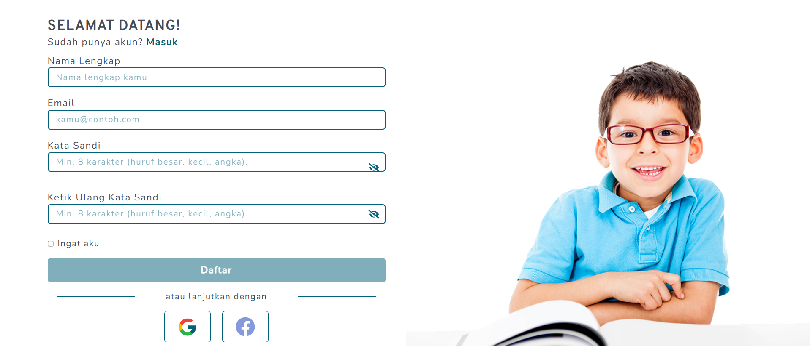
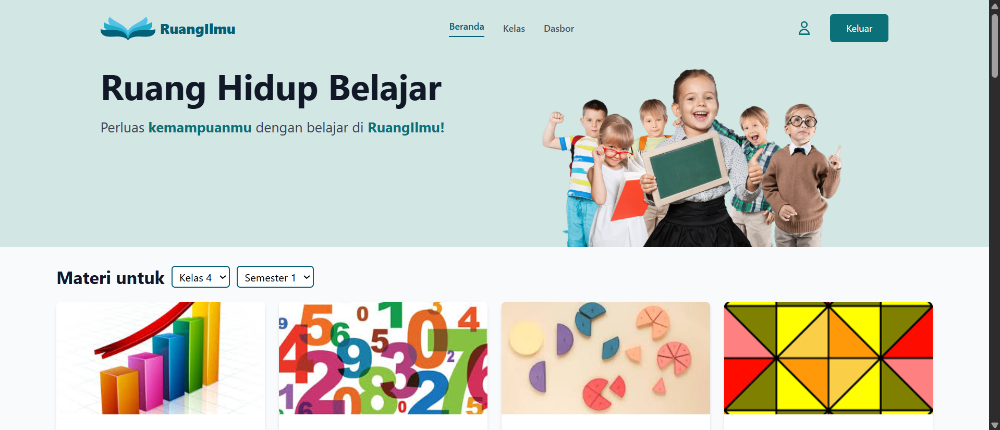
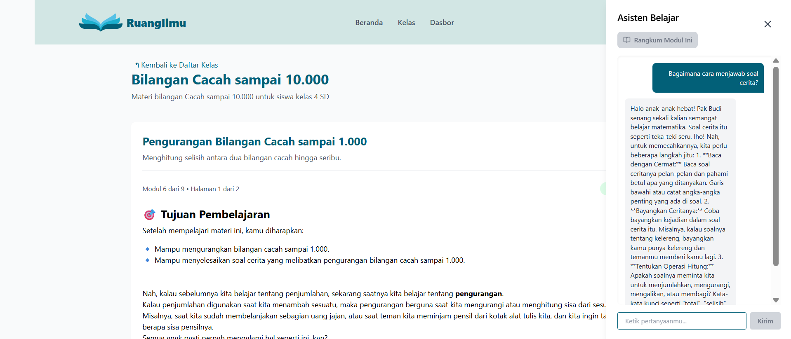
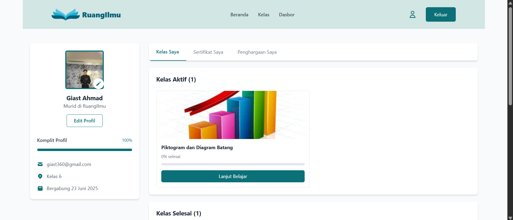
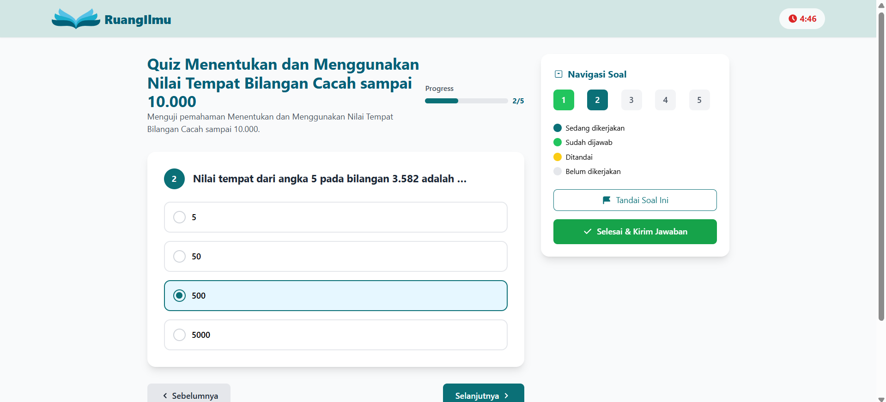
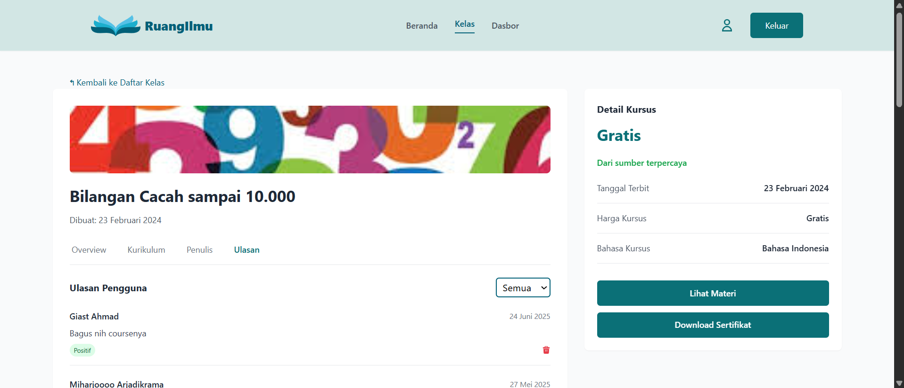

  <h1><b>RuangIlmu: Satu Ruang, Sejuta Ilmu</b></h1>
  

    An interactive digital learning platform specially designed for elementary school students in grades 4, 5, and 6.
  

  

    
    
    
    
  

---

## 📚 About the Project

**RuangIlmu** is a digital learning solution created to make learning easier and more enjoyable for elementary school students in grades 4-6. Recognizing the challenges students might face during self-study, we integrate smart technology to provide instant support and create a seamless and effective learning experience.

This project is a responsive and modern frontend implementation that interacts with a separate backend to provide rich functionality.

## ✨ Key Features

We are proud to present advanced features that set RuangIlmu apart from other platforms:

#### 🤖 **Smart Learning Assistant (Chatbot)**
Students no longer need to feel confused when encountering difficult material. While reading a module, they can directly ask the integrated chatbot, which acts as a personal learning assistant, providing explanations and answers in real-time.

#### 📊 **Automated Review Sentiment Analysis**
To continuously improve the platform's quality, we built a sentiment analysis system. Every review submitted by a user is automatically classified as **positive** or **negative**, allowing our team to quickly understand feedback and make improvements.

### Other Features:
- **User Authentication**: A secure registration and login system.
- **Interactive Dashboard**: A summary of learning progress and quick access to materials.
- **Learning Modules**: Materials structured according to the elementary school curriculum for grades 4-6.
- **Exercises & Quizzes**: Interactive questions to test understanding.
- **Responsive Design**: Optimal display on desktops, tablets, and smartphones.

## 📸 Application Screenshots

Here are some screenshots of the RuangIlmu application.

### Register Page

### Home Page

### Learning Assistant Chatbot

### Student Dashboard

### Profile Page

### Quiz and Test Page

### Course Detail Page

## 🛠️ Technologies Used

| Category  | Technology      |
| :-------- | :-------------- |
| **Core** | React.js        |
| **Styling** | Tailwind CSS    |
| **Routing** | React Router    |

## 🏗️ Project Architecture

This project adopts a **Headless** architecture, where the frontend and backend are developed separately.
- **Frontend (This Repository)**: Responsible for the user interface and interaction.
- **Backend**: Manages business logic, databases, and APIs. The backend repository can be accessed here:
  - **[RuangIlmu Backend Repository](https://github.com/callmeAngga/backend-ruangilmu)**

## 👥 Development Team

This project is a collaboration of students from the Informatics Engineering Program at Universitas Padjadjaran.

| Role   | Name                                      | NPM          |
| :----- | :---------------------------------------- | :----------- |
| **Lead** | Giast Ahmad                               | `140810220018` |
| **Member** | Chienta Fleury                            | `140810210011` |
| **Member** | Theodora Paulina Walukow                  | `140810220058` |
| **Member** | Imam Farrel Rahyandita Soetardjo Prabowo  | `140810220070` |
| **Member** | Angga Prasetyo                            | `140810220086` |

---

  Made with ❤️ by the RuangIlmu Team (2025)

